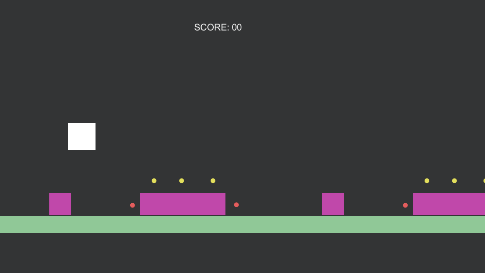
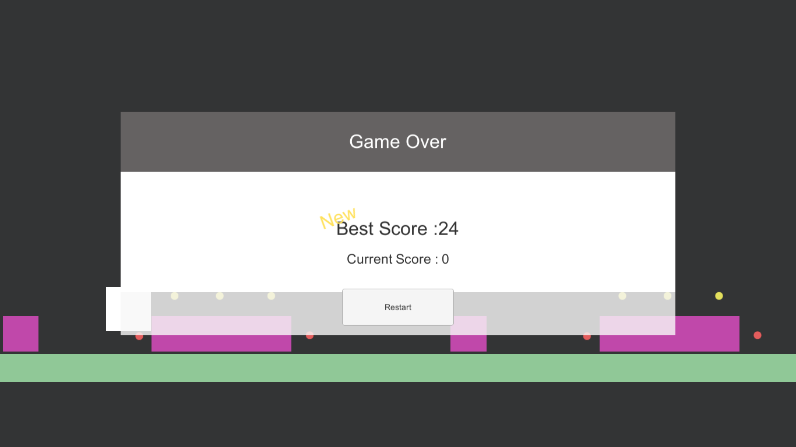

# 2d-endless-platformer
2D endless platformer is a 2D game developed in Unity3D. It is a casual game with randomly generated levels with collision detection from obstacles, and a player stop point when the player character hits a certain point X. It is a simple game project aimed at testing the developers skill on learning basic and intermediate unity functions and utilizing them.

## instructions
avoid the red obstacles and collect the yellow ones. press spacebar to jump. when a red obstacle is hit, game over. when the character moves off screen, game over.

## screenshots

### ingame

Currently has 3 variants of random levels that reoccur. will add more variants in future updates. 

### game over

Includes:
* Best Score
* Current Score
* Restart Button
